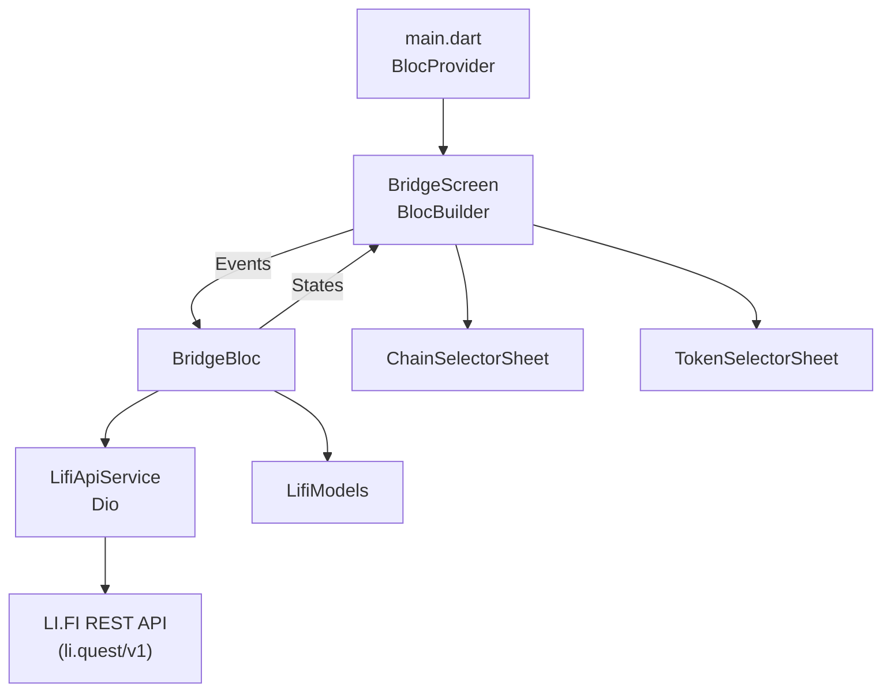

# Walkthrough: LI.FI Bridge Token Integration

## Overview
Integrated the **LI.FI Protocol** REST API into a Flutter app for cross-chain token bridging.
Uses **Flutter Bloc** for state management and **Dio** for HTTP networking.

## Architecture



## Project Structure

```
lib/
├── main.dart                          # BlocProvider setup
├── bloc/
│   ├── bridge_bloc.dart               # Bloc logic + event handlers
│   ├── bridge_event.dart              # Sealed events (Equatable)
│   └── bridge_state.dart              # Immutable state with copyWith
├── models/
│   └── lifi_models.dart               # Data models
├── screens/
│   └── bridge_screen.dart             # UI with BlocBuilder
├── services/
│   └── lifi_api_service.dart          # Dio-based REST client
└── widgets/
    └── chain_token_selector.dart      # Bottom sheet selectors
```

## Key Changes (Provider → Bloc, http → Dio)

| Before | After |
|--------|-------|
| `provider` package | `flutter_bloc` + `equatable` |
| `http` package | `dio` package |
| `ChangeNotifier` + `Consumer` | `Bloc<Event, State>` + `BlocBuilder` |
| Mutable state | Immutable [BridgeState](file:///Users/nexsoft/Documents/JunProjects/testlib/test_sdk_lifi/lib/bloc/bridge_state.dart#5-107) with [copyWith](file:///Users/nexsoft/Documents/JunProjects/testlib/test_sdk_lifi/lib/bloc/bridge_state.dart#50-88) |
| Direct method calls | Event dispatching via `add()` |

## Verification

- ✅ `flutter pub get` — Dependencies resolved
- ✅ `flutter analyze` — **No issues found**
- ✅ Chrome test — UI loads, API calls work, quote returns correctly


